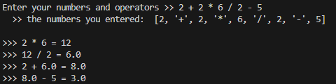

# python-calculator
 ## simple calculator made with Python
* ### solves mathematical expressions with operators +, -, * or /.
* ### respects order of operations, so you get the correct answers.
* ### shows step-by-step simplification, so you can follow how the expression is being solved
* ### simple and quick to use:)

#
#
#

error explanation:
* error 1: something went wrong with multiplication or/and division — possibly due to invalid input
* error 2: something went wrong with addition or/and substraction — possibly due to invalid input

#

## Thank you for reading —— have a wonderful day!:)